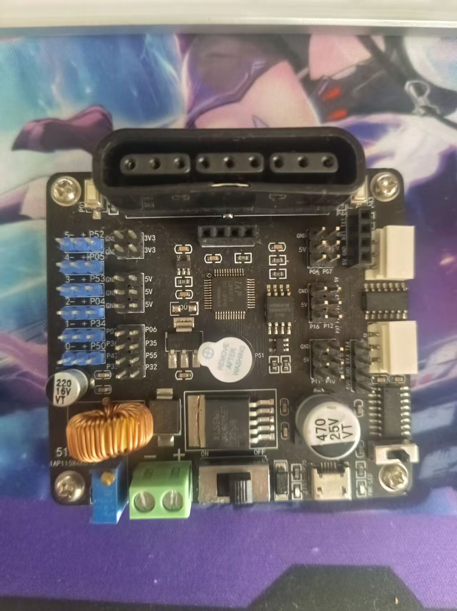
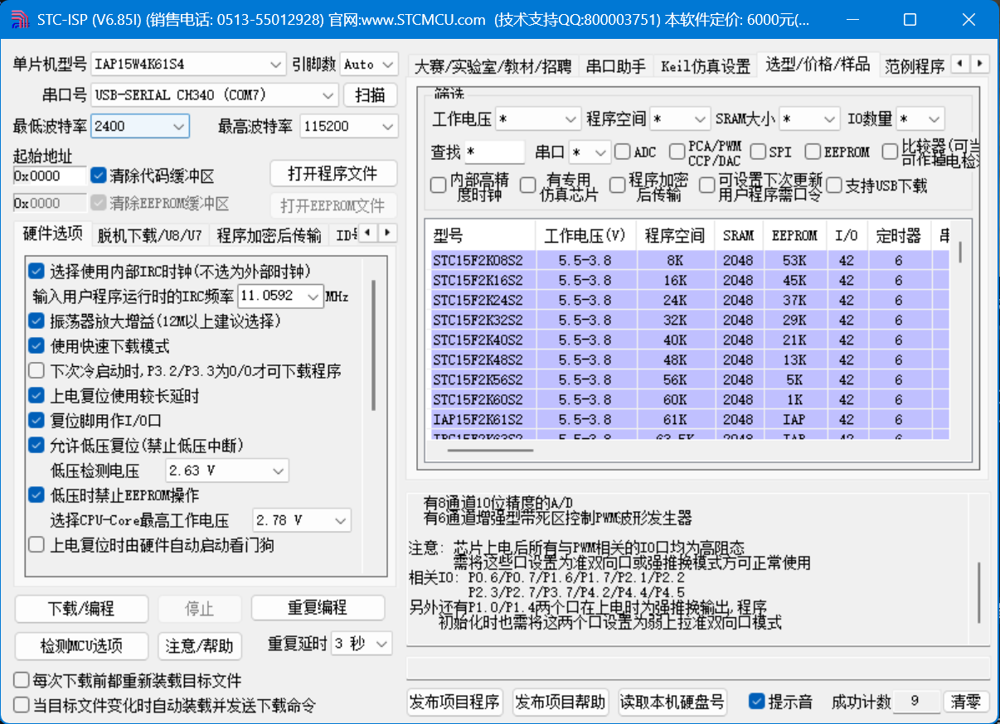

## 下位机开发流程及说明

板子：

认识开发板：
1. 右下角那个是 k1 开关，左off，右on，用来烧录代码和一些工具识别板子连接
2. 右下角 k1 开关 左边是 USB 可连接上位机电脑
3. 中间正下方的大开关是控制电源的开关，左 on，右 off 
4. 左下角的绿色的模块就是接电源线的，电源7-8V的样子
5. 最后是最左边六个蓝色的GPIO接口，由绿色模块外接电源供能

### 1. 硬件连接
- 将开发板通过USB连接到电脑。
- 首先安装驱动，确保电脑能够识别开发板。驱动安装包：`docs\程序固件以及下载教程\CH340 USB转串口驱动\CH341SER\CH341SER\SETUP.EXE`
- 安装完成后，打开设备管理器，确认开发板被识别为一个串口设备（如COM6,可能会变化）。

- 舵机和气泵阀门接线：
- 
- 
- 注意舵机、气泵、阀门都是最浅的那根为信号线，最深的那根接地线，红色接电源正极
  1. 我将底部控制绕z轴旋转的舵机成为`1号`舵机，接蓝色的GPIO接口的 0号，也就是P50
  2. 控制第一个大臂的（控制末端和小臂前伸后缩）的舵机为`2号`，接 P34
  3. 最后一个舵机控制末端上下移动，命名为`3号`, 接P04
  4. 气泵接P53
  5. 电磁阀门接P05

### 2. 硬件型号识别
- 打开工具 `docs\程序固件以及下载教程\stc-isp-15xx-v6.85I.exe`
- 
- 操作：首先`k1`开关和`电源开关`还是关的，先选串口号为`COM6`或者`COM7`，然后点`检测MCU选项`,这时打开k1，就能自动识别到板子的各种型号信息了

### 3. 代码编译和烧录
1. 安装带有证书的`keil c51`,安装包：`KEIL5-51.zip`,注意安装时先关闭安全中心，内含破解工具，教程：https://blog.csdn.net/2301_78343139/article/details/130870622
2. 我们的代码项目：`stc15_robot_arm_controller\STC15_RobotArm_Controller.uvproj`
3. 安装好keil后用keil打开该项目文件并编译，得到编译后的二进制文件：`stc15_robot_arm_controller\Objects\STC15_RobotArm_Controller.hex`
4. 然后可以烧录，步骤：打开烧录工具：`docs\程序固件以及下载教程\stc-isp-15xx-v6.85I.exe`，点击打开程序文件，选择`stc15_robot_arm_controller\Objects\STC15_RobotArm_Controller.hex`，然后保持`USB`连接，`电源开关`关闭，`k1`关闭，点击`下载/编程`,然后打开k1，此时软件能够检测到我们的`单片机`,自动烧录代码，最后检查是否烧录成功。

### 4. 通信控制
- 首先接好线后，一定要保持USB连接，关闭`k1`防止USB供电，然后打开`电源开关`,机械臂会自动回到初始位姿，这时可以通信控制了。
我将通信模块写成python库，见：`tools`文件夹
见 `tools\上位机通信模块说明.md`，里面写了初始位姿
开发的时候直接调用`tools\robot_arm_controller.py`,里面的一些全局变量可以修改

1. 舵机：
    - ｛舵机编号，角度， 运动时间｝
    - 编号之前接线的时候编好了
    - 运动时间规定它必须在这个时间里完成动作，控制运动快慢
2. 气泵就是 on 和 off
3. 阀门就是 close（气道通畅）和 open（气道关闭，不供电时就是关闭的）

>>>

# 吸盘机械臂视觉抓取上位机系统

本项目为基于 STC15 3自由度（3-DOF）吸盘机械臂的上位机视觉控制系统。系统采用“降维”的标定策略（2D透视变换 + 高度补偿），避免了复杂的 3D 手眼标定，能够快速实现桌面级物体的视觉识别与抓取。

## 目录结构
- `kinematics.py`: 核心逆运动学算法库，负责将目标三维坐标 `(X, Y, Z)` 转换为舵机控制角度。
- `四点标定工具.py`: 简易的手眼标定工具，用于生成桌面平面的透视变换矩阵 `homography_matrix.npy`。
- `主程序_A_YOLO11抓取.py`: 终极版抓取程序，使用 YOLOv11 进行目标检测，并根据物体类别自动应用不同的高度补偿。
- `主程序_B_颜色识别抓取.py`: 基础验证版抓取程序，使用 OpenCV 的 HSV 色彩空间识别红色物体（无需深度学习模型）。

## 坐标系定义
为了让物理测量与代码逻辑完全统一，我们定义了以下直观的“物理世界坐标系”：
- **观察视角**：站在机械臂正后方（线束所在侧）往前看。
- **原点 (0, 0, 0)**：机械臂最底部黑色金属底座的中心点在桌面上的投影。
- **X 轴**：正前方。用直尺量取目标点距离中心的直线长度（mm）。
- **Y 轴**：左侧为正。用直尺量取目标点偏左或偏右的距离（mm）。
- **Z 轴**：以**桌面**为绝对零点（Z=0）。物体距离桌面的垂直高度即为 Z 坐标（mm）。

## 抓取失败原因深度剖析与优化指南

如果你在运行主程序时，发现机械臂虽然动了，但吸盘落点与实际物体位置有偏差（抓偏了或者抓空了），这属于正常的物理映射误差。通常由以下几个原因导致：

### 1. 标定矩阵 (Homography) 误差
- **原因**：透视变换矩阵极度依赖你输入的 4 个点。如果在运行 `四点标定工具.py` 时，你用鼠标点击的像素位置，与你用尺子量出来的物理坐标 `(X, Y)` 对应得不够精准，算出来的矩阵就会自带误差。这就像地基没打好，上面盖的楼一定是歪的。
- **优化**：
  - 在桌面上画 4 个非常清晰的小十字准星。
  - **手动把机械臂的吸盘移动到这 4 个十字准星上**，记录此时的物理坐标（可以自己量，或者通过舵机角度反推正运动学）。
  - 在电脑屏幕上点击这 4 个点时，尽量放大点击，确保像素和物理坐标的对应精确到毫米。

### 2. 相机视角带来的透视畸变
- **原因**：普通 USB 相机存在镜头畸变，且如果相机安装得太斜，画面边缘的物体就会发生严重的“透视偏移”。比如一个高 50mm 的橘子，在斜视的画面中，它的像素中心可能并不在它底部中心的正上方。
- **优化**：
  - **尽量把相机安装在机械臂正上方，垂直俯视抓取区域**。俯视角度越垂直，物体高度带来的透视偏移就越小。
  - 尽量把抓取目标放在画面的中央区域，避免在边缘抓取。

### 3. Z 轴高度补偿不匹配
- **原因**：我们的算法通过 `HEIGHT_COMPENSATION` 字典强行给物体指定了一个高度（比如 `target_z = 50`）。如果真实的橘子只有 30mm 高，逆运动学算法算出的三角形大臂和小臂的角度就会出错，导致不仅高度没降下去，连水平落点 `(X, Y)` 也会跟着发生联动偏移。
- **优化**：
  - 仔细测量目标物体的真实高度（最好是测量你希望吸盘吸住的那个面的高度）。
  - 在代码的 `HEIGHT_COMPENSATION` 中精调这个数值。
  - 也可以先让 `target_z = 0`（把物体当成一张纸贴在桌面上），看看机械臂能不能准确定位到它的正上方，如果能，说明 XY 没问题，纯粹是高度补偿没给对。

### 4. 机械硬件本身的回差与组装误差
- **原因**：这种由航模舵机（比如常见的 MG996R）组装的机械臂，内部齿轮存在间隙（Backlash）。有时候你发同样的指令，它顺时针转过去和逆时针转过去，最终停留的物理位置能差出 5 毫米甚至 1 厘米。此外，连杆本身的刚性不足也会导致在不同姿态下产生微小形变。
- **优化**：
  - 这种硬件误差在软件层面极难完全消除。但因为我们使用的是**吸盘**（且带有弹簧缓冲），它本身就具备 1-2 厘米的容错能力。
  - 你可以在代码中故意让 `target_z` 比真实高度**小 10mm**，让机械臂每次抓取都形成一个“下压”的动作，利用弹簧的形变去弥补位置的微小不准，确保吸盘能死死扣住物体。

## 快速测试流程
1. 固定相机位置，运行 `python 四点标定工具.py`。
2. 在桌面上选 4 个点，输入测量的物理坐标，生成 `homography_matrix.npy`。
3. 确保机械臂连接串口。
4. 运行 `python 主程序_A_YOLO11抓取.py`。
5. 将水果模型放入视野，画面提示识别成功后，按键盘 `g` 键触发抓取。