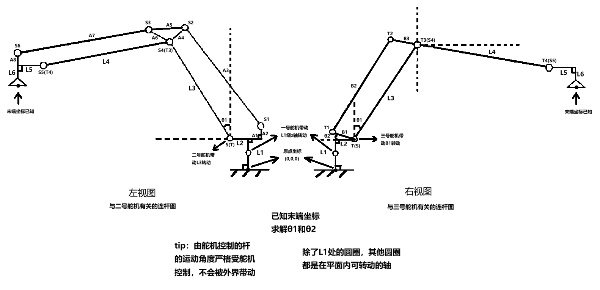

# 机械臂参数说明与数学建模

我们的机械臂实际上有6个连杆：
- L1：L1是竖直基座，L1长度就是基座底部到第一个水平连杆L2（这个连杆始终水平）的距离，L1中间有一个关节，这个关节只会绕竖直轴旋转，初始位姿是竖直的
- L2：第一个水平连杆L2的长度，也就是从L1顶部到第二个关节轴的距离
- L3：第二个关节轴到第三个关节轴的距离，这个连杆可以由舵机驱动转动，初始位姿是竖直的，与L2垂直
- L4：第三个关节轴到第四个关节轴的距离，这个连杆也可以由舵机驱动传动杆B1从而间接驱动其转动，初始位姿是水平的，与L3垂直
- L5：第四个关节轴到末端执行器（一个吸气盘装置）的距离，第四个关节由外部传动杆带动，会带动L5转动，L5初始保持水平。
- L6：L6与L5始终垂直，L6是末端执行器的长度，末端执行器装有弹簧，初始长度初始保持最长，碰到物体可收缩，由于第三关节轴由外部传动杆带动，所以末端执行器能够始终保持垂直于地面，便于吸取物品
- 

- 

固定点：
S = 二号舵机轴中心
T = 三号舵机轴中心 
...

左视图：
- L3: S(T) - S4(T3)
- L4: S4(T3) - S5(T4)
- L5: S5(T4) - 吸盘座
- A1: 固定90度相连于L1一端 - 固定90度相连于A2一端
- A2: 固定90度相连于A1一端 - S1
- A3: S1 - S2
- A4: S2 - S4(T3)
- A5: S2 - S3
- A6: S3 - S4(T3)
- A7: S3 - S6
- A8: S6 - 吸盘座

右视图：
- B1: T(S) - T1
- B2: T1 - T2
- B3: T2 - T3(S4)
- L3: T(S) - T3(S4)
- L4: T3(S4) - T4(S5)

参数：
- L1 = 74mm
- L2 = 23mm
- L3 = 148mm
- L4 = 160mm
- L5 = 33mm
- L6 = 34 ~ 44mm (末端弹簧可缓冲)
传动杆：
- A1 = 36mm
- A2 = 24mm
- A3 = 149mm
- A4 = 42mm
- A5 = 69mm
- A6 = 42mm
- A7 = 160mm
- A8 = 31mm

- B1 = 54mm
- B2 = 148mm
- B3 = 54mm

舵机关节
- L1中间的第一关节由一号舵机控制，可控制整个机械臂绕竖直轴旋转
- L2与L3上相连的的第二关节由二号舵机控制，可控制L3转动
- L3与L4上相连的的第三关节由三号舵机控制，可控制L4转动

三个舵机初始位姿时的角度：{60, 65, 55}
- 一号舵机角度范围：20° ~ 100°
- 二号舵机角度范围：20° ~ 80°
- 三号舵机角度范围：50° ~ 90°

软件建模角定义：
- θ1 = servo2_home - servo2
- θ2 = servo3_home - servo3
- θ1 表示 L3 相对竖直方向的转角
- θ2 表示 B1 相对初始位姿的转角变化
- 当 servo2 增大时，θ1 减小，L3 向后收缩
- 当 servo3 增大时，θ2 减小，B1 下降，L4 上抬

当前软件实现约定：
- 左视图中的 `S1` 是由 `A1/A2` 刚性支架确定的基座固定铰点，不随 `servo2/L3` 一起旋转。
- `FK` 先由左视图 `A` 链闭式求出一组末端候选，再由右视图 `B` 链求出 `L4` 姿态候选，最后按分支匹配选定实际姿态。
- `IK` 不再使用旧的开链二连杆公式，而是基于新的闭式 `FK` 在舵机角空间做粗搜和细化搜索。
