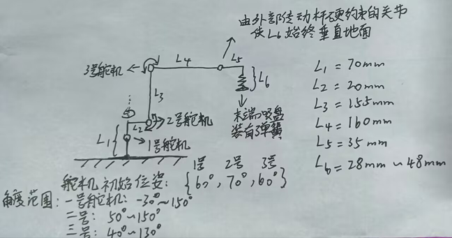
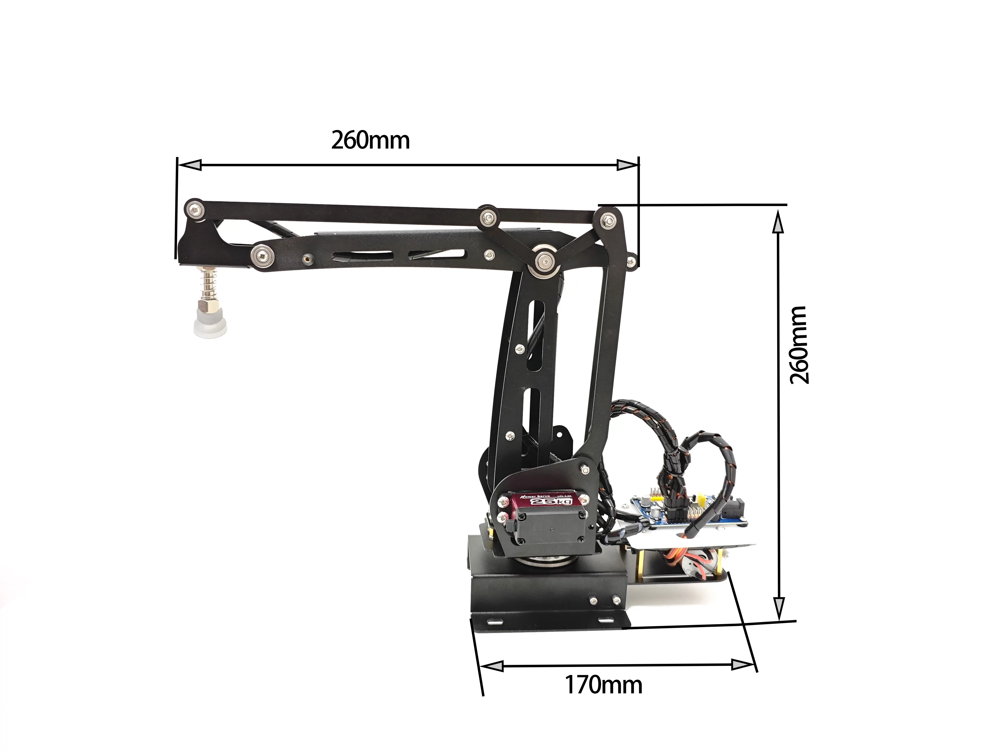

# 机械臂参数说明与数学建模

我们的机械臂实际上有6个连杆：
- L1：L1是竖直基座，L1长度就是基座底部到第一个水平连杆L2（这个连杆始终水平）的距离，L1中间有一个关节，这个关节只会绕竖直轴旋转，初始位姿是竖直的
- L2：第一个水平连杆L2的长度，也就是从L1顶部到第二个关节轴的距离
- L3：第二个关节轴到第三个关节轴的距离，这个连杆可以由舵机驱动转动，初始位姿是竖直的，与L2垂直
- L4：第三个关节轴到第四个关节轴的距离，这个连杆也可以由舵机驱动转动，初始位姿是水平的，与L3垂直
- L5：第四个关节轴到末端执行器（一个吸气盘装置）的距离，第四个关节由外部传动杆带动，会带动L5转动，L5初始保持水平。
- L6：L6与L5始终垂直，L6是末端执行器的长度，末端执行器装有弹簧，初始长度初始保持最长，碰到物体可收缩，由于第三关节轴由外部传动杆带动，所以末端执行器能够始终保持垂直于地面，便于吸取物品
- 

- 
  
参数：
- L1 = 70mm
- L2 = 20mm
- L3 = 155mm
- L4 = 160mm
- L5 = 35mm
- L6 = 28 ~ 48mm (末端弹簧可缓冲)

舵机关节
- L1中间的第一关节由一号舵机控制，可控制整个机械臂绕竖直轴旋转
- L2与L3上相连的的第二关节由二号舵机控制，可控制L3转动
- L3与L4上相连的的第三关节由三号舵机控制，可控制L4转动

三个舵机初始位姿时的角度：{60, 65, 55}
- 一号舵机角度范围：20° ~ 100°
- 二号舵机角度范围：20° ~ 80°
- 三号舵机角度范围：50° ~ 90°
